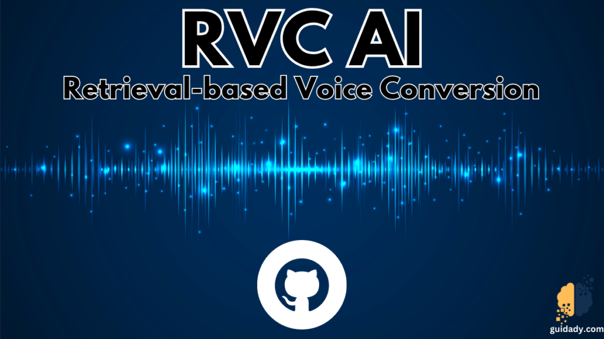

## People

* [Yeongjin Kim](https://github.com/kyj950514 "김영진")
* [Jaeho Lee](https://github.com/Jaeho-99 "이재호")
* [Chankyu Lee](https://github.com/poco7250 "이찬규")
* [Chaelin Ko](https://github.com/chaelin2 "고채린")
* [Seoyeon Choo](https://github.com/ChooSeoyeon "추서연")

## Language / IDE

* ML
  * 
  * 
  * 
  * 
  * 
  * 
* Chrome Extension
  * 
  * 

## Dataset

* 113,006 images

 
 
 

## Model
  
* OCR (CNN - LSTM - CTC Loss)

## Optimizer

* Adam
* Lr = 0.001
* Batch size = 64
* Epochs = 100

## Result

* Train Accuracy : 45.07%
* Val Accuracy : 59.35%

## YouTube

