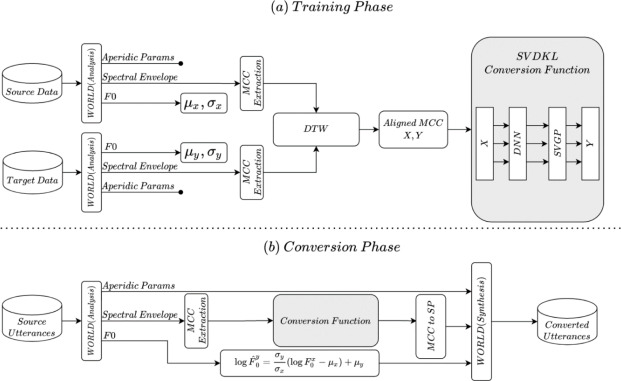
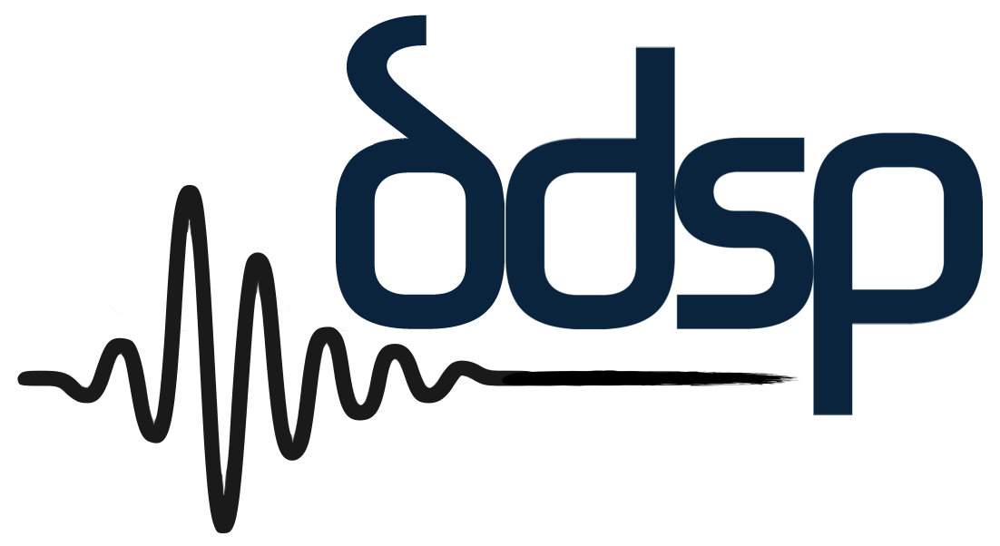

# Singing Voice Conversion

## People

* [Yeongjin Kim](https://github.com/kyj950514 "김영진")
* [Heewon Seo](https://github.com/heewonsuhh "서희원")

## Language / IDE

* 
* 
* 
* 

## Dataset

* Voice: [Yeongjin Kim](https://github.com/kyj950514 "김영진")
* 2 hours audio file (15 minutes of speaking & 1 hour 45 minutes of singing)
* Mono channel 16bit 44,100khz
* .wav file
* No backgroun sound (Noise removal)
* Constant voice size
* The tone is constant, but the range is varied
* Voice volume normalize
* Split by 10 seconds (650 audio files)

## Model

* DDSP-SVC
  * New open source singing voice conversion project dedicated to the development of free AI voice changer software that can be popularized on personal computers.
  * Its training and synthesis have much lower requirements for computer hardware
  * The training time can be shortened by orders of magnitude, which is close to the training speed of RVC.
  * When performing real-time voice changing, the hardware resource consumption of this project is significantly lower than that of SO-VITS-SVC，but probably slightly higher than the latest version of RVC.

ㅤㅤㅤ

 

* RVC
  * Reduce tone leakage by replacing the source feature to training-set feature using top1 retrieval.
  * Easy and fast training, even on relatively poor graphics cards.
  * Training with a small amount of data also obtains relatively good results (>=10min low noise speech recommended)
  * Supporting model fusion to change timbres (using ckpt processing tab->ckpt merge)
  * Easy-to-use Webui interface.
  * Use the UVR5 model to quickly separate vocals and instruments.

ㅤㅤㅤ

## DDSP-SVC

## RVC

